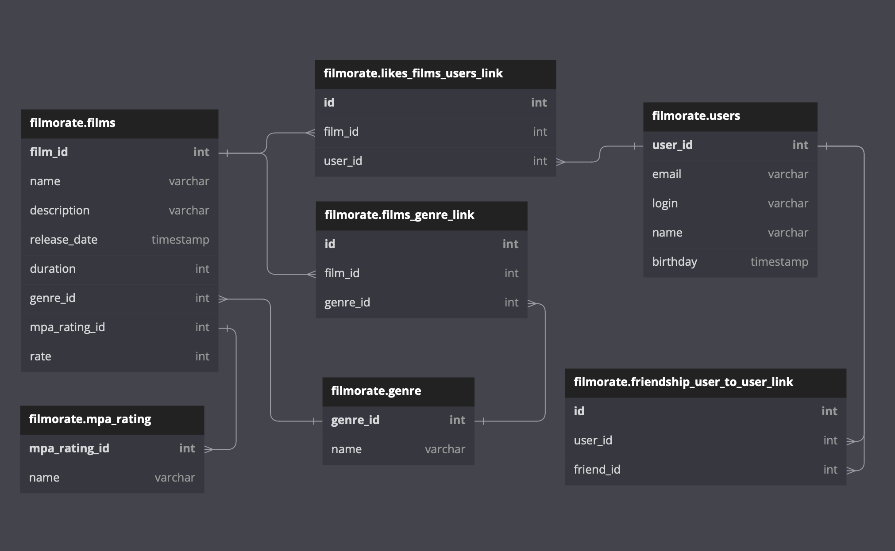

# Filmorate 🎥

Проект социальной сети, которая поможет выбрать кино на основе того, какие фильмы вы и ваши друзья смотрите и какие оценки им ставите. Пользователи могут добавляться в друзья, добавлять редактировать фильмы, оставлять отзывы и оценки, осуществлять поиск фильмов, получать рекомендации к просмотру и выборки самых популярных фильмов.

Монолитное приложение, способное хранить данные в памяти или в базе данных H2. CRUD и другие запросы к базе данных написаны вручную. Полученные данные обрабатываются с помощью RowMapper.

## Основная функциональность

* Регистрация и получение информации о зарегистрированных пользователях
* Добавление и удаление пользователей в список друзей
* Пользователь может получить список своих друзей, а также список друзей, общих с другим пользователем
* Добавление, обновление и удаление фильмов
* Фильмы классифицируются по жанрам и возрастным рейтингам
* Пользователи могут ставить лайки
* Получение подборки самых популярных фильмов

## Схема базы данных

## Инструкция по развёртыванию ▶️
1) Склонируйте репозиторий: https://github.com/Zholtikov-A/java-filmorate.git
2) Запустите проект: ru/yandex/practicum/filmorate/FilmorateApplication.java
3) Проект работает по адресу: http://localhost:8080

## API
* POST /films - создание фильма
* PUT /films - редактирование фильма
* GET /films - получение списка всех фильмов
* GET /films/{id} - получение фильма по id
* PUT /films/{id}/like/{userId} — поставить лайк фильму
* DELETE /films/{id}/like/{userId} — удалить лайк фильма
* GET /films/popular?count={count} — возвращает список из первых count фильмов по количеству лайков. Если значение параметра count не задано, возвращает первые 10

* POST /users - создание пользователя
* PUT /users - редактирование пользователя
* GET /users - получение списка всех пользователей
* GET /users/{id} - получение данных о пользователе по id
* PUT /users/{id}/friends/{friendId} — добавление в друзья
* DELETE /users/{id}/friends/{friendId} — удаление из друзей
* GET /users/{id}/friends — возвращает список друзей
* GET /users/{id}/friends/common/{otherId} — возвращает список друзей, общих с другим пользователем

* GET /genres - получение списка всех жанров
* GET /genres/{id} - получение жанра по id

* GET /mpa - получение списка всех рейтингов
* GET /mpa/{id} - получение рейтинга по id

## Testing
* Postman tests collection: postman/FilmoratePostmanTestsCollection.json
* JUnit5 tests: src/test/java

## 🛠 Tech & Tools

      
      
      
      
    

## Статус и планы по доработке проекта
На данный момент проект проверен и зачтен ревьюером. Планов по дальнейшему развитию проекта нет.

Ссылка на групповой проект: https://github.com/Stepashka37/Filmorate-Application
